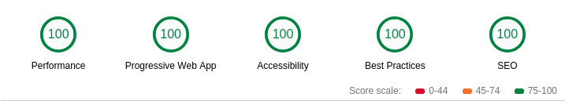
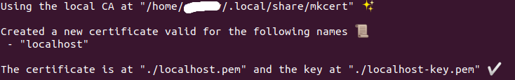
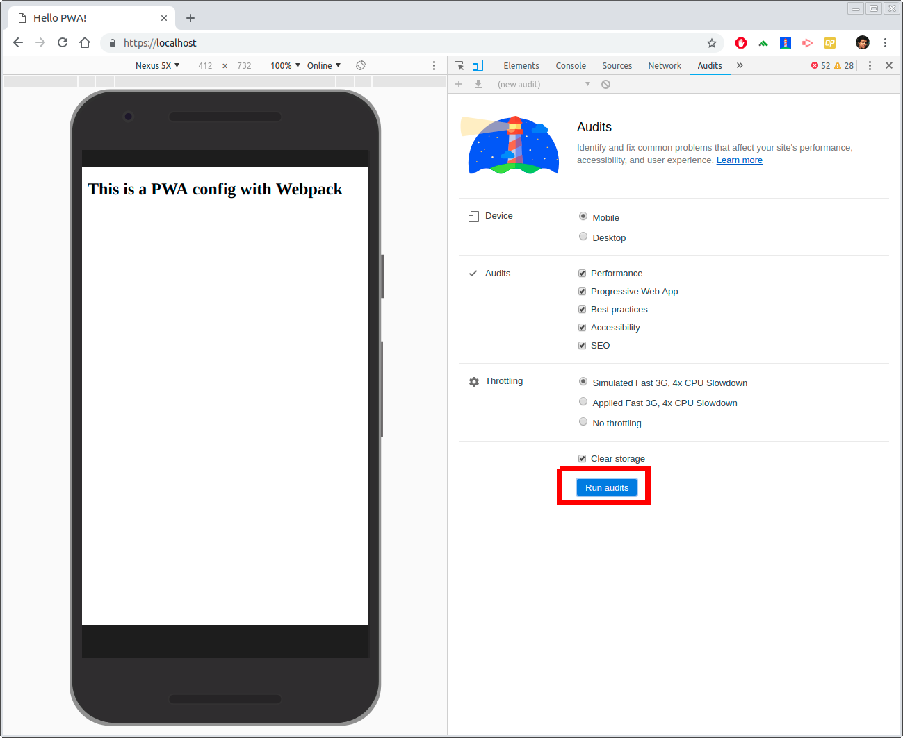
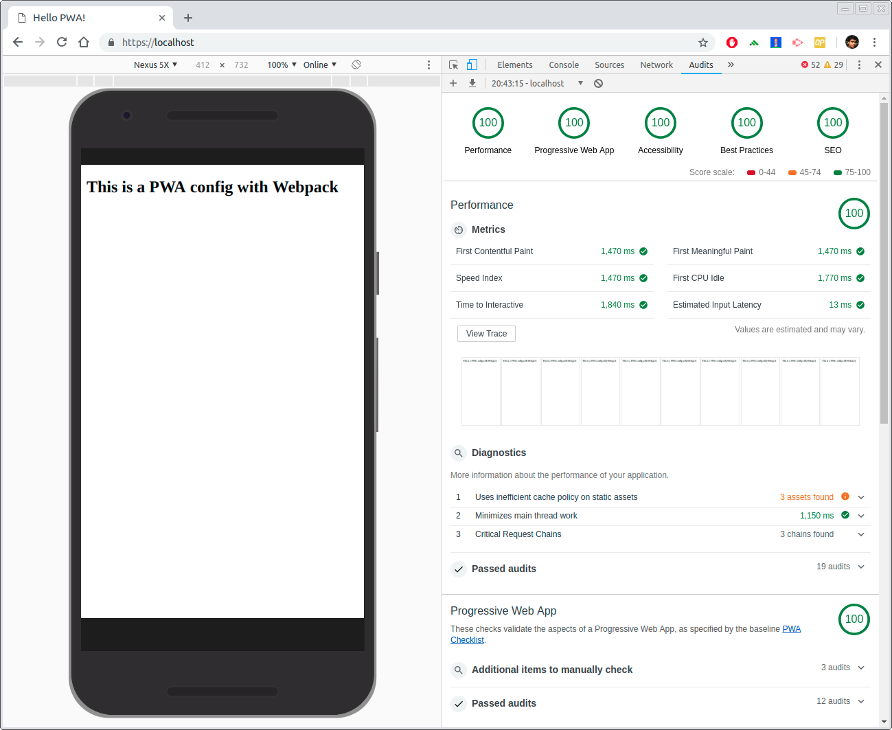

# PWA Webpack Sample
This is a blank PWA setup providing 100% result under Chrome Lighthouse audit

<center></center>

## Prerequisites

- nodejs: https://nodejs.org
- mkcert: https://github.com/FiloSottile/mkcert

## Setup
If you havent already installed mkcert for browser then run
```
mkcert -install
```

Re-open the chrome browser to enable the installed certificates.

Create a certificate for localhost domain

```
mkcert localhost
```

You will see a result similar as below

<center></center>

Copy the path of local CA and update your webpack.config.js. Remeber to add `rootCA.pem` at end of root CA path
```js
https: {
    key: fs.readFileSync('./localhost-key.pem'),
    cert: fs.readFileSync('./localhost.pem'),
    ca: fs.readFileSync('/home/{user-home}/.local/share/mkcert/rootCA.pem')
},
```

Install the modules
```sh
$ npm install
```

### STOP ALL LOCAL SERVERS ON PORT 80 AND 443

Start the project
```sh
$ sudo npm start
```
Go to Chrome and open https://localhost with developers tool. Go to Audits tab and hit `Run audits`

<center></center>

## Final Result

You will see a result similar to below image

<center></center>
